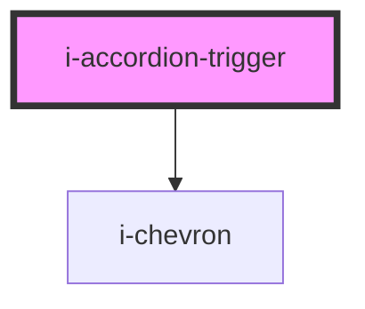

# i-accordion-trigger

<!-- Auto Generated Below -->

## Events

| Event                     | Description | Type                            |
| ------------------------- | ----------- | ------------------------------- |
| `accordionTriggerClicked` |             | `CustomEvent<{ key: string; }>` |

## Dependencies

### Depends on

- [i-chevron](../../i-chevron)

### Graph

----------------------------------------------

*Built with InfinityUI*
