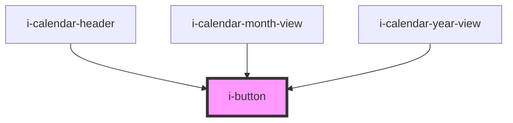

# i-button

<!-- Auto Generated Below -->

## Properties

| Property        | Attribute        | Description | Type                                                                          | Default     |
| --------------- | ---------------- | ----------- | ----------------------------------------------------------------------------- | ----------- |
| `classes`       | `classes`        |             | `string`                                                                      | `''`        |
| `color`         | `color`          |             | `"danger" \| "default" \| "primary" \| "secondary" \| "success" \| "warning"` | `'default'` |
| `disableRipple` | `disable-ripple` |             | `boolean`                                                                     | `false`     |
| `disabled`      | `disabled`       |             | `boolean`                                                                     | `false`     |
| `size`          | `size`           |             | `"lg" \| "md" \| "sm" \| "xl" \| "xs"`                                        | `'md'`      |
| `variant`       | `variant`        |             | `"flat" \| "ghost" \| "light" \| "outline" \| "shadow" \| "solid"`            | `'solid'`   |

## Dependencies

### Used by

 - [i-calendar-header](../i-calendar/i-calendar-header)
 - [i-calendar-month-view](../i-calendar/i-calendar-month-view)
 - [i-calendar-year-view](../i-calendar/i-calendar-year-view)

### Graph

----------------------------------------------

*Built with InfinityUI*
