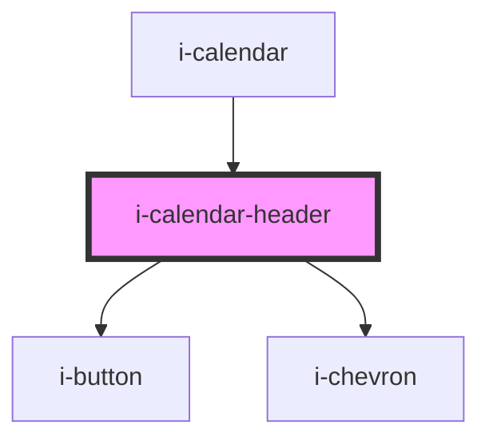

# i-calendar-header

<!-- Auto Generated Below -->

## Properties

| Property            | Attribute          | Description | Type                                                                          | Default     |
| ------------------- | ------------------ | ----------- | ----------------------------------------------------------------------------- | ----------- |
| `calendarHeading`   | `calendar-heading` |             | `Element \| HTMLElement \| string`                                            | `undefined` |
| `color`             | `color`            |             | `"danger" \| "default" \| "primary" \| "secondary" \| "success" \| "warning"` | `'default'` |
| `handleNext`        | --                 |             | `() => void`                                                                  | `undefined` |
| `handlePrev`        | --                 |             | `() => void`                                                                  | `undefined` |
| `readOnly`          | `read-only`        |             | `boolean`                                                                     | `undefined` |
| `toggleCurrentView` | --                 |             | `() => void`                                                                  | `undefined` |

## Dependencies

### Used by

 - [i-calendar](..)

### Depends on

- [i-button](../../i-button)
- [i-chevron](../../i-chevron)

### Graph

----------------------------------------------

*Built with [StencilJS](https://stenciljs.com/)*
