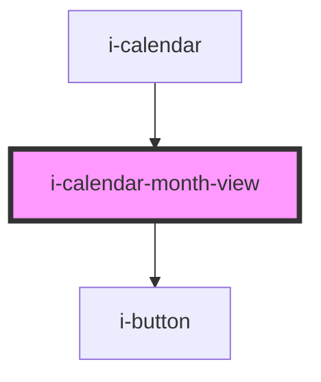

# i-calendar-month-view

<!-- Auto Generated Below -->

## Properties

| Property              | Attribute       | Description | Type                                                                          | Default     |
| --------------------- | --------------- | ----------- | ----------------------------------------------------------------------------- | ----------- |
| `color`               | `color`         |             | `"danger" \| "default" \| "primary" \| "secondary" \| "success" \| "warning"` | `'default'` |
| `handleDateSelection` | --              |             | `(date: string) => void`                                                      | `undefined` |
| `maxDate`             | `max-date`      |             | `string`                                                                      | `undefined` |
| `minDate`             | `min-date`      |             | `string`                                                                      | `undefined` |
| `monthInView`         | `month-in-view` |             | `number`                                                                      | `undefined` |
| `readOnly`            | `read-only`     |             | `boolean`                                                                     | `undefined` |
| `selected`            | `selected`      |             | `string`                                                                      | `undefined` |
| `yearInView`          | `year-in-view`  |             | `number`                                                                      | `undefined` |

## Dependencies

### Used by

 - [i-calendar](..)

### Depends on

- [i-button](../../i-button)

### Graph

----------------------------------------------

*Built with InfinityUI*
