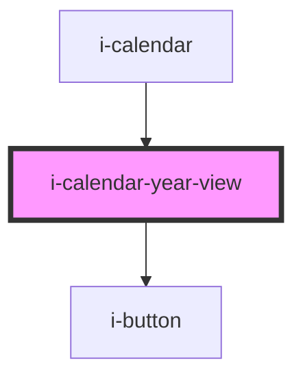

# i-calendar-year-view

<!-- Auto Generated Below -->

## Properties

| Property                   | Attribute                     | Description | Type                                                                          | Default     |
| -------------------------- | ----------------------------- | ----------- | ----------------------------------------------------------------------------- | ----------- |
| `color`                    | `color`                       |             | `"danger" \| "default" \| "primary" \| "secondary" \| "success" \| "warning"` | `'default'` |
| `handleYearSelection`      | --                            |             | `(year: number) => void`                                                      | `undefined` |
| `readOnly`                 | `read-only`                   |             | `boolean`                                                                     | `undefined` |
| `selectedDateComponents`   | --                            |             | `{ date: number; month: number; year: number; }`                              | `undefined` |
| `yearInView`               | `year-in-view`                |             | `number`                                                                      | `undefined` |
| `yearNavigationRangeValue` | `year-navigation-range-value` |             | `number`                                                                      | `undefined` |

## Dependencies

### Used by

 - [i-calendar](..)

### Depends on

- [i-button](../../i-button)

### Graph

----------------------------------------------

*Built with InfinityUI*
