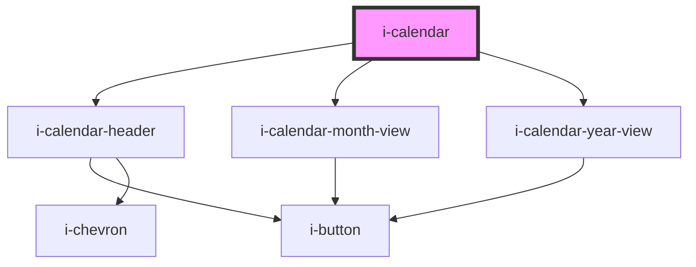

# i-calendar

<!-- Auto Generated Below -->

## Properties

| Property   | Attribute   | Description | Type                                                                          | Default     |
| ---------- | ----------- | ----------- | ----------------------------------------------------------------------------- | ----------- |
| `color`    | `color`     |             | `"danger" \| "default" \| "primary" \| "secondary" \| "success" \| "warning"` | `'default'` |
| `maxDate`  | `max-date`  |             | `string`                                                                      | `undefined` |
| `minDate`  | `min-date`  |             | `string`                                                                      | `undefined` |
| `readOnly` | `read-only` |             | `boolean`                                                                     | `false`     |
| `selected` | `selected`  |             | `string`                                                                      | `undefined` |

## Events

| Event        | Description                         | Type                  |
| ------------ | ----------------------------------- | --------------------- |
| `dateSelect` | handles the calendar date selection | `CustomEvent<string>` |

## Dependencies

### Depends on

- [i-calendar-header](i-calendar-header)
- [i-calendar-month-view](i-calendar-month-view)
- [i-calendar-year-view](i-calendar-year-view)

### Graph

----------------------------------------------

*Built with InfinityUI*
