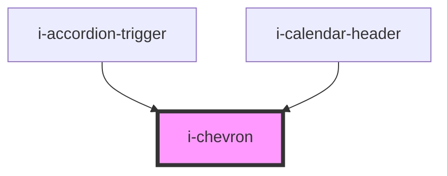

# i-chevron

<!-- Auto Generated Below -->

## Properties

| Property    | Attribute   | Description | Type                                  | Default |
| ----------- | ----------- | ----------- | ------------------------------------- | ------- |
| `direction` | `direction` |             | `"down" \| "left" \| "right" \| "up"` | `'up'`  |

## Dependencies

### Used by

 - [i-accordion-trigger](../i-accordion/trigger)
 - [i-calendar-header](../i-calendar/i-calendar-header)

### Graph

----------------------------------------------

*Built with [StencilJS](https://stenciljs.com/)*
